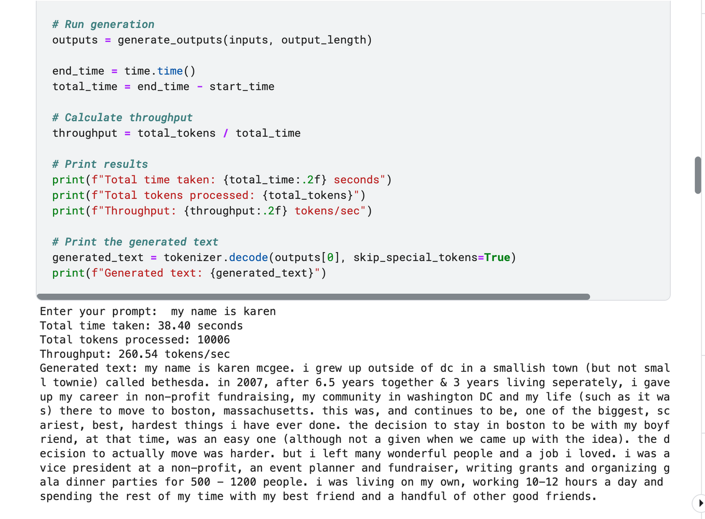

# Performance Optimzation

Kaggle notebook
`https://www.kaggle.com/code/ariyasaran/ml-mixtral-assignopt/notebook`

Running Inference Scripts

```sh
python3 Infernce_scripts/Base_script.py --model mistralai/Mistral-7B-v0.1 --prompt "I am batman" --output_length 1000
```

Run Tests scrits directly

```sh
python3 test.py
```


## Small Comparsion
*it is a very simple comparsion not taking in account many things*


**Groq = 559 tokens/sec > Our's = 260 tokens/sec > fireworks = 251 tokens/sec**




## TODO

- [ ] **Improve speed:** Using vLLM and awq quantization to imporve speed
- [ ] **More on Quantization:** trying 2bit and 3bit using llama.cpp (gguf models)
CS-SUP
- [ ] **Modify code for kaggle notebook** Modifying the code for the kaggle notebook support bc it has 2*T4 GPU
 .....on ...

